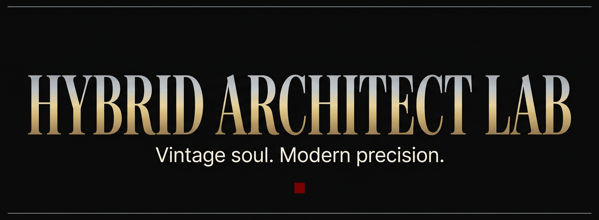

  

  Computational engineering · Parametric CAD · Applied ML · Visual identity systems

  Based in South Tangerang, Indonesia · Open to remote roles worldwide

---

## ⚙️ Tech Stack

<b>Languages</b>

  
  
  
  
  

<b>3D & Parametric CAD</b>

  
  

<b>Data & ML</b>

  
  

<b>Web</b>

  
  
  
  

<b>Design & Tools</b>

  
  
  
  

---

## About

I work across four disciplines that most people treat as separate:
**engineering precision, computational mathematics, 3D design, and brand systems.**
The connecting thread is a single conviction —

> *Precision without aesthetic intention leaves a system incomplete.*
> *Aesthetic vision without structural integrity leaves it unreliable.*

I build at the convergence of those two requirements.

Background: physics-grounded Python, parametric CAD (Onshape + Blender),
applied ML, and TypeScript when web work calls for it. Currently shipping
the **[Hybrid Architect Lab](https://github.com/kiki007-lab/hybrid-architect-lab)** —
my independent R&D portfolio.

---

## Currently

- 🔬 Building parametric drone systems & physics simulations
- 🎨 Maintaining a Neo-Classical visual identity system across all projects
- 📡 Open to remote roles — full-time, contract, or freelance
- ✍️ Available for technical engagements at the intersection of engineering + design

---

## Reach me

**LinkedIn:** [linkedin.com/in/rizky-m-b4904838a](https://linkedin.com/in/rizky-m-b4904838a)

**Email:** [rizky.meilandi007@gmail.com](mailto:rizky.meilandi007@gmail.com)

---

This profile is built in the same Neo-Classical palette as my work. 
Vintage soul. Modern precision.
